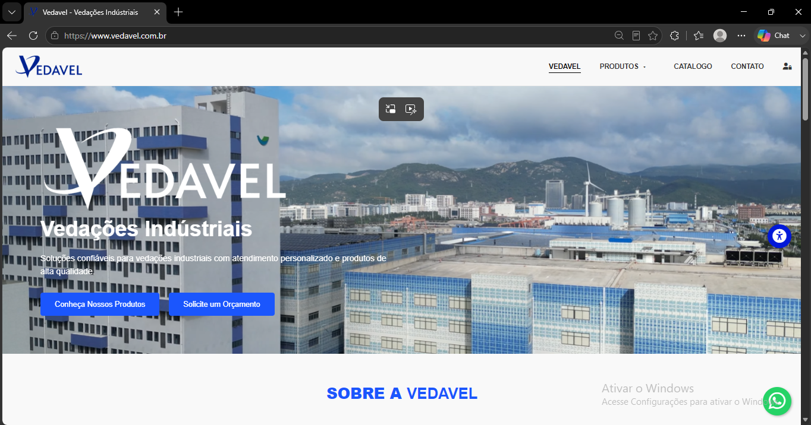
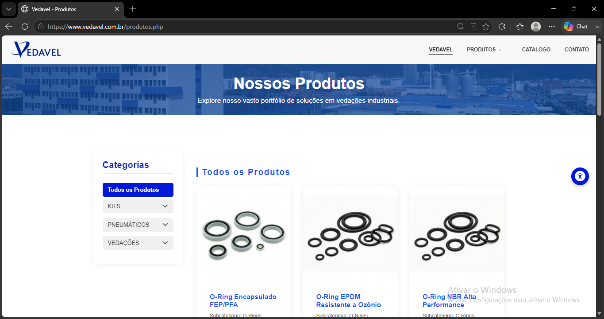
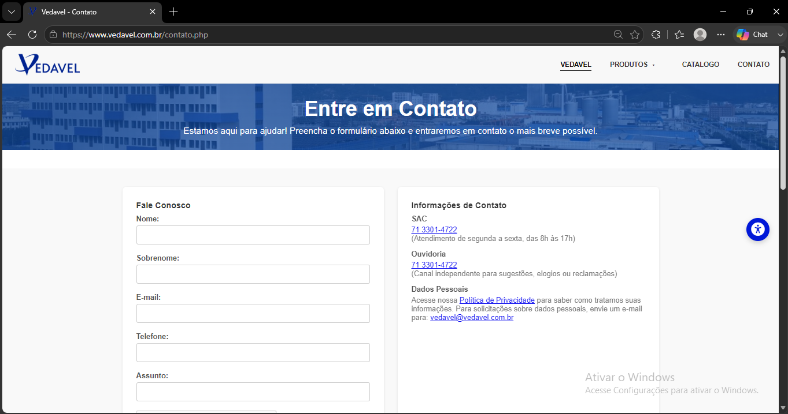
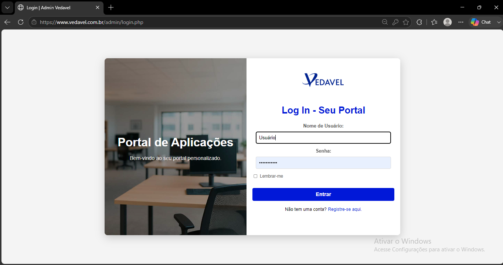

# Vedavel - Vedações Industriais

Projeto institucional e comercial desenvolvido para a Vedavel, com foco em apresentação de marca, catálogo de produtos e conversão de leads por meio de contato e páginas de solução em vedações industriais.

## Visão geral

Este projeto foi construído como uma solução personalizada para um cliente, com foco em:

- apresentação institucional da empresa
- catálogo de produtos e categorias
- páginas de detalhe com informações técnicas
- formulário de contato para geração de oportunidades
- experiência visual voltada para conversão e credibilidade

## Stack

- PHP
- MySQL/MariaDB
- HTML5, CSS3 e JavaScript
- estrutura server-side em páginas dinâmicas
- layout responsivo para desktop e mobile

## Destaques

- interface institucional profissional
- catálogo organizado por categoria e produto
- estrutura simples e funcional para gestão de conteúdo
- foco em usabilidade e apresentação visual
- área administrativa para manutenção do catálogo

## Screenshots

### Home

### Catálogo de produtos

### Página de contato

### Painel administrativo

## Arquitetura

A estrutura do projeto foi organizada para separar responsabilidades entre:

- camada de apresentação: páginas públicas e templates
- camada de conteúdo: catálogo, categorias e detalhes de produto
- camada administrativa: gestão de produtos e conteúdo
- camada de dados: banco MySQL/MariaDB com conexão em PHP

A organização foi pensada para manter o sistema simples, funcional e fácil de manter, com foco em performance, facilidade de atualização e apresentação institucional.

## Observação importante

Este repositório foi preparado como material de apresentação para clientes e portfólio, não como projeto público de código aberto. Partes sensíveis do sistema, configurações internas e arquivos do cliente foram removidos ou mantidos fora do controle de versionamento.

## Site

[www.vedavel.com.br](https://www.vedavel.com.br/)
